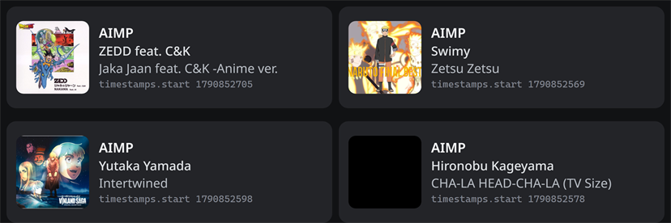

# AIMP Discord Presence

  

AIMP Discord Presence shows what you are listening to in [AIMP](https://www.aimp.ru)
as a Discord Rich Presence, the same way Spotify does. As you play, pause, or
switch tracks, Discord updates with the artist, the song, the album artwork, and
- if you want it - the elapsed time. On your profile it appears as
*Listening to* AIMP.

## Artwork

The plugin resolves cover art through four layers, and stops at the first one
that yields a usable image:

1. **The art embedded in your file.** AIMP's own providers are asked first, so
   the cover you already have is the cover Discord shows.
2. **A sidecar image.** If the tags carry no art, the plugin looks for a
   conventional cover file (`cover`, `folder`, `front`, `album`, `albumart`, or
   Windows Media Player's `AlbumArtSmall`/`AlbumArt_{GUID}_Large`) in the track's
   folder and up to four folders above it, so a multi-disc album whose art sits
   at the album level still shows its cover. Cover files are read, never decoded
   or rewritten.
3. **A keyless online lookup.** If neither local layer produced art, the plugin
   asks a few public music services for the cover. No accounts and no API keys
   are involved, and you can turn this step off in the config.
4. **A plain black placeholder.** If nothing is found, or online lookups are
   disabled, the card gets a solid black image rather than an empty one.

The two local layers (embedded art and sidecar) publish the image through a
small upload-host chain so Discord can fetch it: an optional GitHub repository
you own, then catbox, uguu, and litterbox. The GitHub host is used only when you
set `CoverToken` in the config; with an empty token it is omitted and the
keyless hosts handle the upload. The upload hosts are all inside the local
layers - a host failure still falls through to the online lookup, never straight
to black. Every key, including `CoverToken` and `CoverRepo`, is documented in
[docs/BUILDING.md](docs/BUILDING.md).

## What you get

- Discord Rich Presence while AIMP plays: artist, song, album and artwork.
- The *Listening* activity type, so Discord says "Listening to AIMP".
- Optional elapsed or remaining time. Timestamps are absolute, so Discord counts
  them down client-side, and presence is only sent when something changes.
- Small play, pause and radio badges, each configurable. The radio badge carries
  the text "Listening to URL".
- Reconnection if Discord restarts, with updates coalesced to stay inside
  Discord's rate limit. The plugin never launches Discord for you.
- Configuration through a plain ini file, so there is no settings window to
  click through. Every key is listed in [docs/BUILDING.md](docs/BUILDING.md).

No line repeats a value already shown on another line, so a self-titled track
cannot print the same text twice, and the default configuration shows the artist
in the member-list status line.

## Install

Download a built release from the
[Releases page](https://github.com/nathwn12/aimp-discord-presence2/releases), or
build it yourself. The full walkthrough - requirements, installing a release,
building from source, and every configuration key - lives in
[docs/BUILDING.md](docs/BUILDING.md).

It runs on Windows and needs the Discord desktop client, running - the browser
version of Discord will not work. In short: open AIMP's Settings, go to Plugins,
click Install, and point it at the release archive (or at the
`aimp_discordPresence.dll` you built), then restart AIMP. One Discord setting
matters too: under Settings, Activity Privacy, "Share your detected activities
with others" must be on, or nothing will show.

## Screenshots

These four cards are rendered from the plugin's real captured payloads: two
tracks whose own artwork was used, a keyless online match, and the black
placeholder after a real search returned nothing. They are not a screenshot of
anyone's Discord account, and no avatar or username was invented.

## About this fork

The original plugin is by **Exle**:
<https://github.com/Exle/aimp-discord-presence>. Upstream has been quiet since
June 2024, and this repository (`aimp-discord-presence2`) is where development
continues now. It is not the official upstream, and nothing here suggests that
Exle endorses it. The original design, the AIMP C++ wrapper design, and the
shared Discord application ID all come from that work; this fork would not exist
without it.

One upstream piece is gone: Exle's `aimp-sdk-cpp-wrapper` repository has been
deleted from GitHub, and a clone now fails with *Repository not found*. Because
that source disappeared, this fork ships its own glue layer under
`lib/aimp-glue/` - a small `Aimp::` C++ façade written directly over the AIMP SDK
headers, to keep the project building. The wrapper design is still Exle's; only
the implementation had to be replaced.

## Personal use

This plugin is for personal use, and it is free to use by anyone. There is no
licence file in this repository; the statement above is the whole of it. Credit
for the original work belongs to Exle.

## Not in the AIMP catalogue

This plugin is not published on AIMP's website and is not part of AIMP's official
plugin catalogue - you will not find it there. Install it by hand, following
[docs/BUILDING.md](docs/BUILDING.md).
