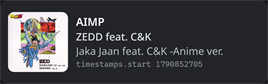
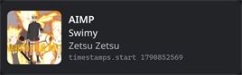
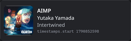
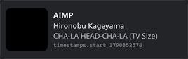

# AIMP Discord Presence

<p align="center">
  
</p>

A Windows plugin for [AIMP](https://www.aimp.ru) that publishes a **Discord Rich
Presence** for whatever you are currently listening to.

As you play, pause, or switch tracks, the plugin updates Discord with the track
title, artist, album art, an optional playback timestamp, and a small status
badge. On your Discord profile it appears as **Listening to** the app - the same
pattern Spotify uses.

> **This is a fork.** The original plugin and its author are **Exle**:
> <https://github.com/Exle/aimp-discord-presence>. This repository is a personal
> fork (`aimp-discord-presence2`) that has been modernized to **v2.0.0**. The
> original design, the AIMP C++ wrapper design, and the shared Discord
> application ID all come from Exle's upstream work. This fork would not exist
> without it.
>
> One upstream piece is gone: Exle's original C++ wrapper
> (`aimp-sdk-cpp-wrapper`) is **no longer available** - its repository has been
> deleted from GitHub, and a clone now fails with *Repository not found*. Because
> that source disappeared, this fork ships its own in-repo glue layer under
> `lib/aimp-glue/`: a small `Aimp::` C++ façade implemented directly over the AIMP
> SDK headers. The wrapper **design** is still Exle's; this fork only had to
> reimplement it to keep building.

## Usage posture

This plugin is for **personal use**, and it is **free to use by anyone**. There
is no licence file in this repository; the statement above is the whole of it.
Credit for the original work belongs to **Exle**.

## Not in the AIMP catalogue

This plugin is **not** published on AIMP's website and is **not** part of AIMP's
official plugin catalogue. You will not find it there. Install it manually using
the steps below.

---

## Features

- **Discord Rich Presence while AIMP plays** - track title, artist, album, art,
  and elapsed/remaining time.
- **Activity type: Listening.** Discord shows *"Listening to ..."* rather than
  *"Playing ..."*.
- **Artist -> song -> album layout.** Line 1 is the app name, line 2 (`details`)
  is the **artist** (the track title when the artist tag is empty, or `AIMP`
  when both are empty), line 3 (`state`) is the **song title** (the album when
  the title tag is empty or would repeat the artist line), the **large image**
  is the **album art**, and its tooltip (`large_text`) is the **album**
  (omitted when it would repeat either line). No line repeats a value already
  shown on another line, so a self-titled track cannot print the same text
  twice. With the default `StatusDisplayType=2` Discord renders the **artist**
  in the member-list status line.
- **Album art from the internet.** Art is resolved on demand from keyless public
  APIs - **[Deezer](https://developers.deezer.com/api)** `/search/album` first,
  then the **[iTunes Search API](https://performance-partners.apple.com/search-api)**
  (upscaled `artworkUrl100`), then
  **[MusicBrainz](https://musicbrainz.org)** + **[Cover Art Archive](https://coverartarchive.org)**.
  Resolved art is cached in memory. If art cannot be resolved, or online lookups
  are disabled, the plugin falls back to the bundled `aimp` asset.
- **Small image / status badge.** Play, pause, and radio icons, each configurable.
  The radio badge is shown for URL streams and carries the text
  *"Listening to URL"*.
- **Timestamps (optional).** Show elapsed or remaining time. Timestamps are
  absolute, so Discord counts down client-side; presence is sent **on change
  only**.
- **Reconnect.** The plugin survives a Discord restart. If Discord is not running
  it stays idle and reconnects by itself. It **never** launches Discord.
- **Rate-limit correct.** Updates are coalesced to stay under Discord's limit of
  5 updates per 20 seconds.
- **Attributed.** Plugin metadata credits the original author, Exle.

## Requirements

- **Windows** (64-bit).
- The **Discord desktop client**, running. The plugin talks to Discord locally; it
  does not work with the browser-only version.
- For building from source only: **Visual Studio 2022 or newer build tools** and
  **CMake >= 3.28**.

---

## Installation (prebuilt)

1. **Get the plugin.** Download a built release archive from the
   [Releases page](https://github.com/nathwn12/aimp-discord-presence2/releases)
   of this fork, or build it yourself (see [Build from source](#build-from-source)
   below).
2. **Open the plugin installer in AIMP.** In AIMP, open **Settings** (the gear
   icon), or **right-click the title bar ▸ Settings**. Go to the **Plugins**
   section and click **Install**.
3. **Select the archive or the `.dll`.** Point AIMP at the release archive, or at
   `aimp_discordPresence.dll` if you built it yourself.
4. **Let AIMP extract it.** AIMP installs the plugin into its own per-plugin
   folder, `AIMP\Plugins\aimp_discordPresence\`.
5. **Enable it and restart.** Make sure the plugin is enabled in the Plugins list,
   then restart AIMP.
6. **Enable activity sharing in Discord.** Open Discord, go to **Settings ▸
   Activity Privacy**, and enable **"Share your detected activities with
   others"**. **Presence will not appear without this.**
7. **Play something.** Start playback in AIMP; the presence should appear on your
   Discord profile.

## Build from source

The repository builds with CMake. Its one external dependency, the **AIMP SDK**,
is a git submodule (`lib/aimp-sdk`) and must be checked out too. There is no
Discord RPC library to fetch: Discord integration is implemented in-repo, with
`src/discord_ipc.*` speaking Discord's local IPC protocol over the
`\\.\pipe\discord-ipc-N` named pipe directly. The AIMP SDK glue is likewise
in-repo, under `lib/aimp-glue/` (see the fork note above).

**Prerequisites:** Windows, Visual Studio 2022 or newer build tools, CMake >= 3.28.

```powershell
# Clone this fork together with its AIMP SDK submodule.
git clone --recursive https://github.com/nathwn12/aimp-discord-presence2.git
cd aimp-discord-presence2

# If you cloned without --recursive, initialize the submodule instead:
# git submodule update --init --recursive

# Configure (64-bit, version stamping on).
cmake -B build -A x64 -DAUTOVERSIONING=ON

# Build the Release configuration.
cmake --build build --config Release
```

The built plugin lands at:

```
output/Release/aimp_discordPresence/x64/aimp_discordPresence.dll
```

Install that DLL using the manual steps above (AIMP ▸ Settings ▸ Plugins ▸
Install).

---

## Configuration

Configuration is **ini-only** - there is no settings UI. Settings live in AIMP's
config file at `Profile/AIMP.ini`, in the `[DiscordPresence]` section. (You can
find the Profile folder location in AIMP's settings.)

> **AIMP must be closed while you edit `Profile/AIMP.ini`.** Changes are written
> by AIMP on exit and are not picked up while it is running.

### Keys

| Key | Type | Description |
| --- | --- | --- |
| `ApplicationID` | integer | Discord application ID used to publish the presence. The default is the shared upstream ID. You may substitute your own ID (create one in the [Discord developer portal](https://discord.com/developers/applications)). |
| `Timestamp` | bool | Show playback timestamps. `0` = elapsed time, `1` = remaining time. |
| `UseAlbumArt` | bool | Use the album art as the large image. `0` = off, `1` = on. |
| `UseAlbumArtOnline` | bool | Allow **network** album-art lookups (Deezer, then iTunes, then MusicBrainz + Cover Art Archive). `0` = never go online; always use the offline built-in asset. `1` = allow online lookups. |
| `LocalCover`, `CoverCache` | bool, string | Publish the track's own (offline) cover so Discord can fetch the real artwork. `LocalCover`: `0` = off, `1` = on (default); a published cover is used only after the upload proves retrievable. `CoverCache`: optional file that remembers published cover URLs by image hash. Empty (the default) resolves to `cover-cache.txt` beside the plugin DLL; a bare filename resolves there too, an absolute path is used as given. |
| `StatusDisplayType` | int | What the member-list status text shows: `0` = app name, `1` = **song title** (the `state` line), `2` = **artist** (default). |
| `DebugLog` | string | Optional file that receives the Discord IPC frame log, for diagnosing connection problems. Empty (the default) disables it. A bare filename is written next to the plugin DLL; an absolute path is used as given. |
| `State.UsePlay` | bool | Show a small play badge. `0` = off, `1` = on. |
| `State.PlayImage` | string | Image used for the play badge (a bundled asset name or a URL). |
| `State.UsePause` | bool | Show a small pause badge. `0` = off, `1` = on. |
| `State.PauseImage` | string | Image used for the pause badge. |
| `State.UseRadio` | bool | Show the radio badge for URL streams. `0` = off, `1` = on. |
| `State.RadioImage` | string | Image used for the radio badge. The radio badge also carries the text *"Listening to URL"*. |

### Example `Profile/AIMP.ini`

```ini
[DiscordPresence]
; Discord application ID. Default is the shared upstream ID; replace with your own if you like.
ApplicationID=429559336982020107

; Show playback timestamps (0 - elapsed time / 1 - time remaining). Default: 0
Timestamp=0

; Use the album art as the large image. Default: 1
UseAlbumArt=1

; Allow network album-art lookups (Deezer, then iTunes, then MusicBrainz). 0 = always use the offline asset. Default: 1
UseAlbumArtOnline=1

; Member-list status text: 0 = app name / 1 = song title / 2 = artist. Default: 2
StatusDisplayType=2

; Small status badges.
State.UsePlay=0          ; Show the play badge. Default: 0
State.PlayImage=aimp_play ; Image for the play badge
State.UsePause=0         ; Show the pause badge. Default: 0
State.PauseImage=aimp_pause ; Image for the pause badge
State.UseRadio=1         ; Show the radio badge for URL streams. Default: 1
State.RadioImage=aimp_radio ; Image for the radio badge
```

---

## Screenshots







---

## Troubleshooting

**Presence does not appear.**
Check Discord first: **Discord ▸ Settings ▸ Activity Privacy ▸ "Share your
detected activities with others"** must be enabled. This is the most common cause.
Also make sure the **Discord desktop client** is running, and that the plugin is
enabled and AIMP has been restarted.

**Album art is missing.**
The large image is filled from online lookups only when both `UseAlbumArt=1` and
`UseAlbumArtOnline=1`. If `UseAlbumArtOnline=0`, or the track cannot be matched by
the keyless providers (Deezer `/search/album`, iTunes Search, MusicBrainz + Cover
Art Archive), the plugin falls back to the bundled `aimp` asset by design.

**My configuration changes do nothing.**
AIMP must be **closed** while you edit `Profile/AIMP.ini`. Reopen AIMP after
saving.

**I changed `ApplicationID` and now nothing shows.**
The replacement ID must be a valid Discord application with Rich Presence
enabled in the [Discord developer portal](https://discord.com/developers/applications).

## Limitations

- **Windows-only.** The plugin is built for the Windows AIMP desktop app.
- **Ini-only configuration.** There is no settings UI, and AIMP must be closed to
  edit the config.
- **Requires the Discord desktop client.** A browser-only Discord will not work,
  and the plugin never launches Discord for you.
- **Shared application ID.** The default `ApplicationID` is the upstream one, so
  everyone using the default appears under the same Discord application.
- **Not in the AIMP catalogue.** This plugin is not listed on AIMP's website.
- **Reimplemented glue layer.** Exle's original `aimp-sdk-cpp-wrapper` is gone from
  GitHub, so the AIMP SDK is reached through this fork's own `lib/aimp-glue/`
  façade - a reimplementation of that vanished wrapper, not the original code.

## Credits

- **Exle** - original author of the plugin. Upstream:
  <https://github.com/Exle/aimp-discord-presence>. The original design, the AIMP
  C++ wrapper design (`aimp-sdk-cpp-wrapper`), and the Discord application ID come
  from upstream. Exle also maintains the AIMP SDK fork this project builds against
  (<https://github.com/Exle/aimp-sdk>).
- **nathwn12** - personal fork (`aimp-discord-presence2`) and the v2.0.0
  modernization: internet album art, the Listening activity type, and the
  Spotify-style layout. Also reimplemented the vanished wrapper as the in-repo
  `lib/aimp-glue/` layer.
